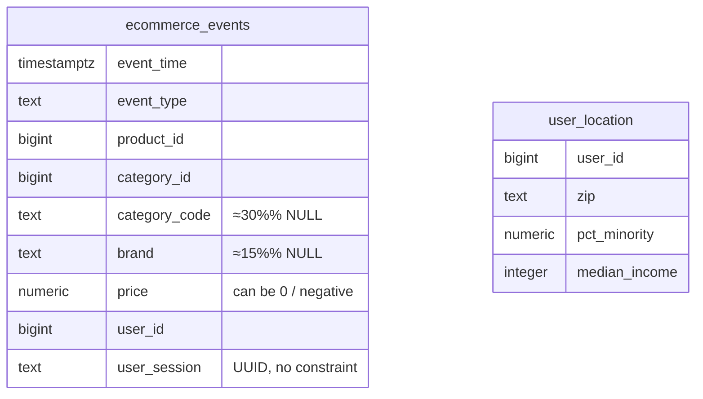
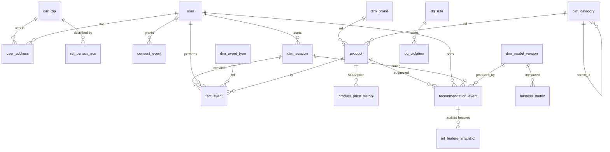

# OmniStyle — Source ↔ Target 3NF Data Model (REES46 / event-stream)

> Goal: every column has a single owner, every product attribute is stored once,
> every recommendation is reproducible, and every join to demographics passes
> through the audit pipeline — never the recommender.

This document accompanies:

- `source_ddl.sql`   — the **as-is** wide event-stream table
- `target_ddl.sql`   — the **target** 3NF schema with star + governance + recommender provenance
- `migration_map.csv` — column-level lineage between the two

---

## 1. Source schema (as-is — REES46 / Kaggle shape)

The system that produced the redlining incident lands its data in a single
wide table. This is the format `2019-Nov.csv` from Kaggle, and it is a
faithful reflection of how most off-the-shelf collectors work.



### Why this is not 3NF — and how each defect maps to a real problem

| Defect | NF rule violated | Real-world consequence |
|---|---|---|
| `category_code` and `brand` repeated on every event row | 3NF — non-key attributes (product attributes) duplicated outside their parent | A product re-tagged on Wednesday yields rows with conflicting `category_code` for the same `product_id` |
| `category_code` is dot-delimited (`electronics.audio.headphone`) | 1NF — repeating group encoded as a string | Cannot pivot to "show me total revenue at level-1 category" without parsing every row |
| No PK / FK anywhere | Integrity | At-least-once delivery from Kafka → silent duplicates inflate funnel rates |
| `price` snapshotted per event but never versioned | Audit-ability | Cannot reconstruct "was it on sale?" |
| `user_id` has no parent table | Integrity / governance | Consent revocations, DSAR deletions, fairness audits have no anchor |
| **Recommender's decisions absent** | Audit-ability | We see what the user clicked but not what was ranked above it. Audits of redlining behaviour are impossible from this table |

---

## 2. Target schema (3NF + governance + recommender provenance)

Six layers, each with a single responsibility:



### 2.1 Table inventory

**Reference / Dimension**

| Table | PK | Notes |
|---|---|---|
| `dim_zip` | `zip5` | Canonical 5-char ZIP. |
| `dim_brand` | `brand_id` | UNIQUE on `brand_name`. |
| `dim_category` | `category_id` | **Self-referential hierarchy** (`parent_id`). `electronics.audio.headphone` becomes 3 rows. `full_path` UNIQUE. |
| `dim_event_type` | `event_type_code` | Replaces the free-text `event_type` string. |
| `dim_model_version` | `model_version_id` | One row per deployed model. |
| `ref_census_acs` | `(zip5, year)` | Demographic profile per ZIP per year. **Read-only by audit pipelines.** |

**Master**

| Table | PK | Notes |
|---|---|---|
| `user` | `user_id` | Anchor for FK + governance. PII pseudonymised via `email_hash`. |
| `omnistyle_pii.user_pii` | `user_id` | Restricted-access PII mirror. |
| `user_address` | `address_id` | SCD-2: every move generates a new row. |
| `product` | `product_id` | FK to `dim_brand`, `dim_category`. |
| `product_price_history` | `(product_id, valid_from)` | SCD-2 price (replaces unversioned `price` column). |
| `dim_session` | `session_uuid` | Parent of every event row; stores `started_at`, `last_event_at`, `n_events`. |

**Fact**

| Table | PK | Notes |
|---|---|---|
| `fact_event` | `event_id` | One row per behavioural event. **`event_hash` UNIQUE — kills duplicates from Kafka replay.** FKs to user / session / product / event_type. |
| `recommendation_event` | `rec_id` | What the model emitted. FK to `model_version`. |
| `ml_feature_snapshot` | `snapshot_id` | Every feature passed to the model — **with a CHECK constraint forbidding geographic features**. |

**Governance** (`omnistyle_gov` schema)

| Table | PK | Notes |
|---|---|---|
| `consent_event` | `consent_id` | Every grant / revoke. |
| `dq_rule` | `rule_id` | Catalogue of every check (one row per row in `data_quality_issues.csv`). |
| `dq_violation` | `violation_id` | Row-level offender → rule. |
| `fairness_metric` | `metric_id` | Disparate-impact / exposure-KL / etc. per `(model_version, evaluated_at)`. |
| `audit_log` | `event_id` | Every PII read, every demographic join, every model deploy. |
| `data_lineage` | `lineage_id` | Source-table → target-table → transform_id. |

### 2.2 The CHECK constraint that prevents redlining

```sql
ALTER TABLE ml_feature_snapshot
  ADD CONSTRAINT no_geo_features
  CHECK (feature_name NOT IN
    ('zip','zip5','zip_code','city','state','lat','lng',
     'longitude','latitude','region_id','neighborhood'));
```

This is a *structural* control. The recommender cannot consume geographic
features because the database physically refuses to log them. Any attempt to
do so raises a constraint violation at write time, which the model platform
treats as a deployment-blocker.

### 2.3 What the audit pipeline does (read-side)

The view `v_event_with_demographics` joins `fact_event → user → user_address →
ref_census_acs` — so the *audit* pipeline can compute disparate-impact ratios
nightly. The CRITICAL discipline: this view is **never** queried by the
recommender. Access is controlled by row-level security and logged in
`audit_log`.

---

## 3. Source → target migration map

See `migration_map.csv` for the full column-level lineage. Highlights:

| Source | Target | Transform |
|---|---|---|
| `ecommerce_events.event_time` | `fact_event.event_time` | + CHECK ≤ NOW() + 5 min |
| `ecommerce_events.event_type` | `dim_event_type.event_type_code` + `fact_event.event_type_code` | string → FK lookup |
| `ecommerce_events.product_id` | `product.product_id` + `fact_event.product_id` | FK enforced |
| `ecommerce_events.category_id` | `dim_category.rees46_category_id` | preserved + parsed via `category_code` |
| `ecommerce_events.category_code` | `dim_category` (3-level rows) + `product.category_id` | **dot-string → 3 normalised rows; removed from fact** |
| `ecommerce_events.brand` | `dim_brand` + `product.brand_id` | **removed from fact**, FK only |
| `ecommerce_events.price` | `fact_event.price_at_event` + `product_price_history.price` | SCD-2 price history added |
| `ecommerce_events.user_id` | `user.user_id` + `fact_event.user_id` | FK enforced; `user` table added as anchor |
| `ecommerce_events.user_session` | `dim_session.session_uuid` + `fact_event.session_uuid` | promoted to a real entity |
| `(none — source had no event PK)` | `fact_event.event_id`, `fact_event.event_hash` | **synthetic — finally allows dedup** |
| `(none — source had no recommender data)` | `recommendation_event`, `ml_feature_snapshot` | **NEW — recommender provenance** |
| `(none)` | `fairness_metric`, `dq_rule`, `dq_violation`, `audit_log`, `consent_event`, `data_lineage` | **NEW — governance layer** |

---

## 4. Why this design specifically prevents the redlining incident

1. **The recommender cannot see geography.** `ml_feature_snapshot` has a CHECK
   constraint blocking `zip*`, `city`, `lat`, `lng`, `region_id`. The CI gate
   for any new model also runs an introspection step that walks the feature
   set and aborts on any geographic name.

2. **Every recommendation is reproducible.** `recommendation_event` plus
   `ml_feature_snapshot` mean we can replay any past prediction with the exact
   features the model received — necessary for any external audit.

3. **The fairness gate is structural.** `fairness_metric` is populated by a
   nightly job joining `fact_event` to demographics. A row with `passed = false`
   triggers PagerDuty and blocks the next deployment. The schema *guarantees*
   the metric exists per model version per week.

4. **Demographics are quarantined.** `ref_census_acs` lives in the same database
   but is read-only to recommender service accounts. Joins between the recommender
   and this table are recorded in `audit_log` and reviewed weekly.
