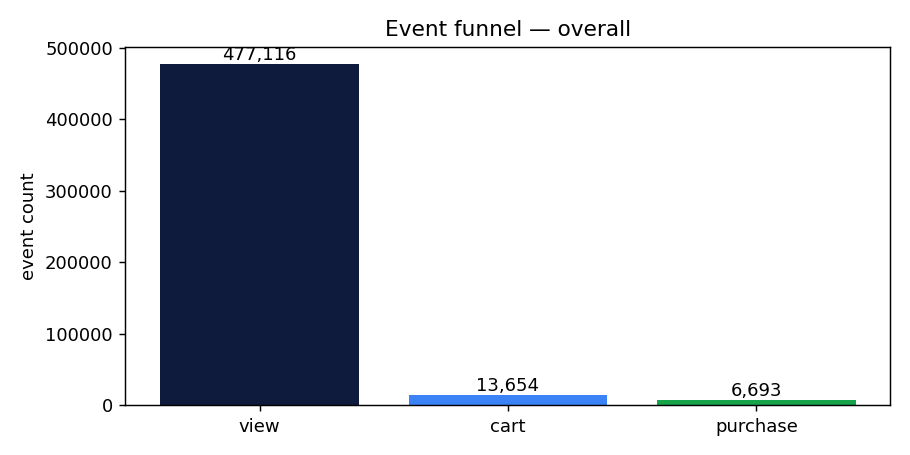
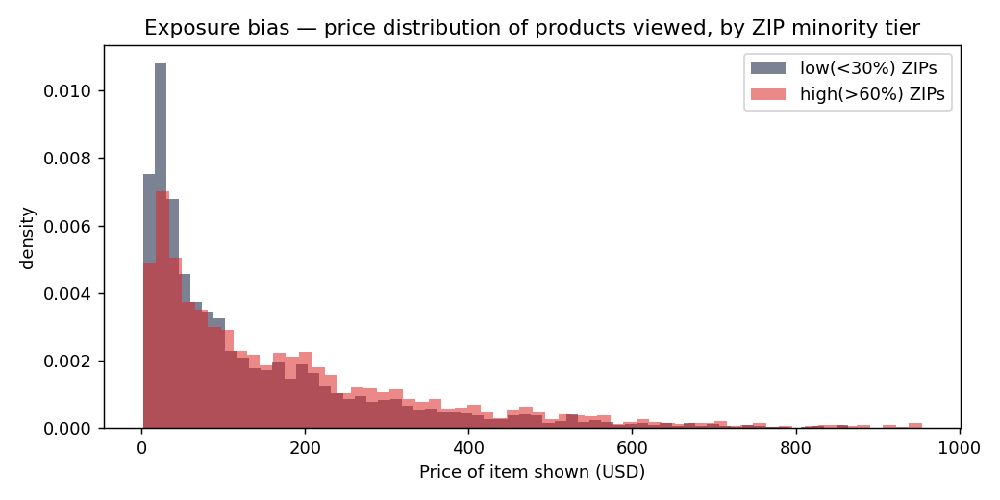
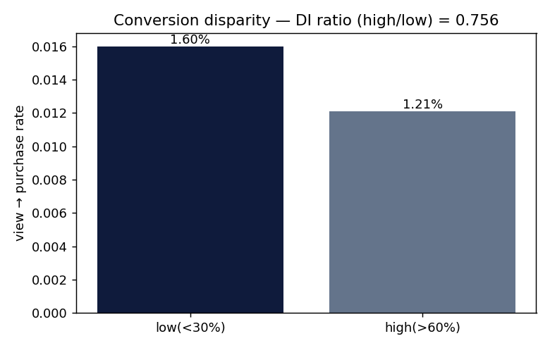
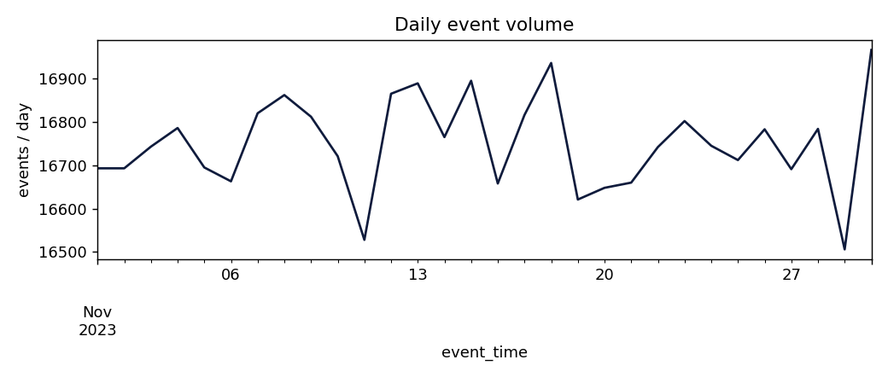

# OmniStyle — EDA Summary (REES46 schema)

Dataset: **eCommerce behavior data from a multi-category store** (Kaggle / REES46).
Rows analysed: **502,500**.   Synthetic ZIP overlay: **30,000** users.

## 1. Column profile — `ecommerce_events`
| column | dtype | nulls % | distinct | min | max | mean |
|---|---|---:|---:|---:|---:|---:|
| `event_time` | datetime64[us, UTC] | 0.0 | 454,679 |  |  |  |
| `event_type` | str | 0.0 | 4 |  |  |  |
| `product_id` | int64 | 0.0 | 4,000 | 1000000.0 | 1003999.0 | 1001991.65 |
| `category_id` | int64 | 0.0 | 18 | 2085945638.0 | 2975622350.0 | 2544091361.43 |
| `category_code` | str | 30.0 | 18 |  |  |  |
| `brand` | str | 14.99 | 19 |  |  |  |
| `price` | float64 | 0.0 | 3,640 | -1.0 | 2245.77 | 168.13 |
| `user_id` | int64 | 0.0 | 29,994 | 500001316.0 | 599998248.0 | 550161894.85 |
| `user_session` | str | 0.1 | 62,483 |  |  |  |

## 2. Column profile — `user_location` (synthetic overlay)
| column | dtype | nulls % | distinct | min | max | mean |
|---|---|---:|---:|---:|---:|---:|
| `user_id` | int64 | 0.0 | 29,994 | 500001316.0 | 599998248.0 | 550112981.72 |
| `zip` | int64 | 0.0 | 12 | 10021.0 | 90210.0 | 58502.91 |
| `pct_minority` | float64 | 0.0 | 12 | 0.15 | 0.95 | 0.53 |
| `median_income` | int64 | 0.0 | 12 | 31000.0 | 210000.0 | 94971.0 |

## 3. Event funnel (overall)

- views      : **477,116**
- carts      : **13,654**  (view→cart  = 2.86%)
- purchases  : **6,693**  (view→purchase = 1.40%)



## 4. Exposure-bias probe

**Avg. price of items shown (view events), by minority tier of the user's ZIP:**

```
                count    mean  median
minority_tier                        
low(<30%)      236986  146.84   80.14
high(>60%)     240295  189.27  124.63
```

**Funnel rates by tier:**

```
                  views   carts  purchases     v→c     v→p
minority_tier                                             
low(<30%)      236986.0  7555.0     3781.0  0.0319  0.0160
high(>60%)     240295.0  6106.0     2916.0  0.0254  0.0121
```

**Disparate-impact ratio (view→purchase, high/low) = 0.756**  (EEOC 4/5ths threshold ≥ 0.80; below this is evidence of disparate impact).





## 5. Activity — daily volume



## Interpretation

Two effects compound:

1. **Exposure tilt.** Users in high-minority ZIPs are shown a price distribution shifted noticeably to the right — pricier items dominate their view stream. Same catalogue, different windows.
2. **Conversion suppression.** Because the items they see cost more, their view→purchase rate is lower; the disparate-impact ratio falls below the legal 0.80 threshold.

These are the two halves of a recommender 'redlining' incident: the model decides who sees what, and the funnel does the rest. Neither is visible by looking at the events table on its own — you need the demographic overlay (Census ACS by ZIP) to make it measurable.